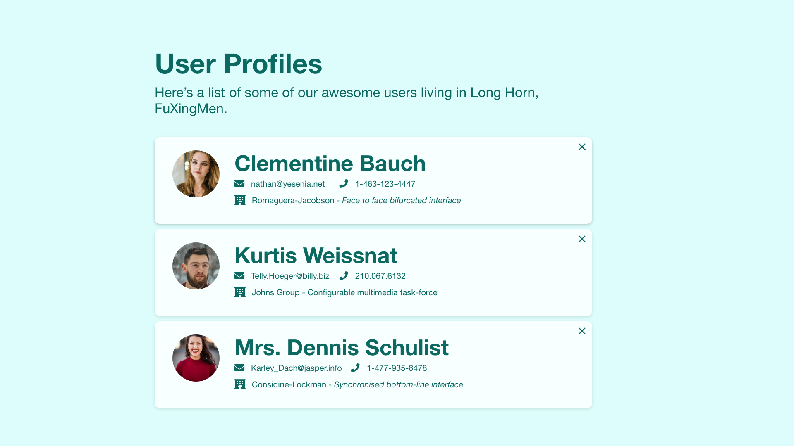
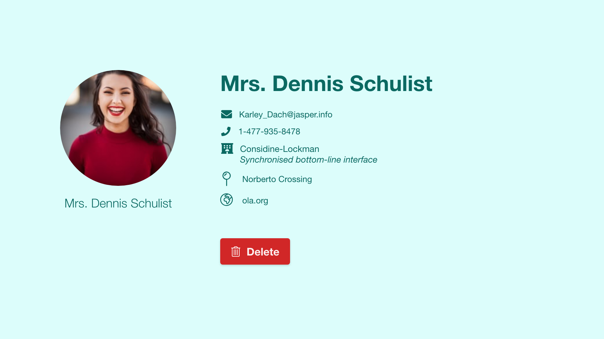
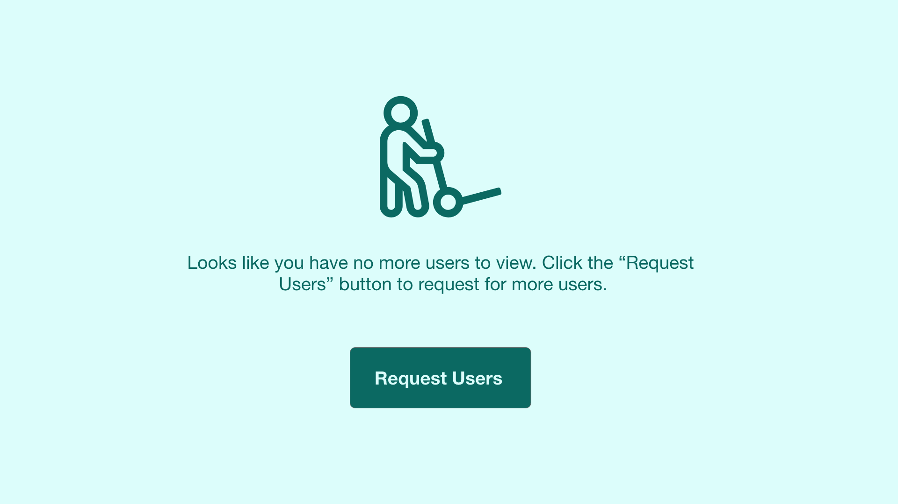
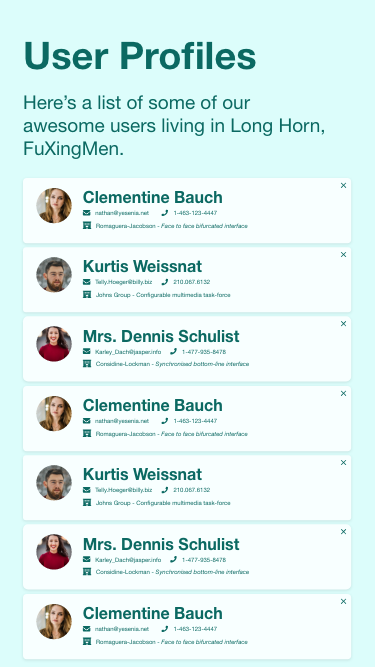
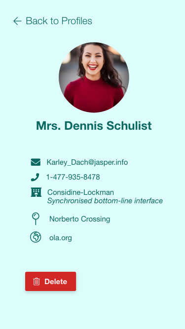
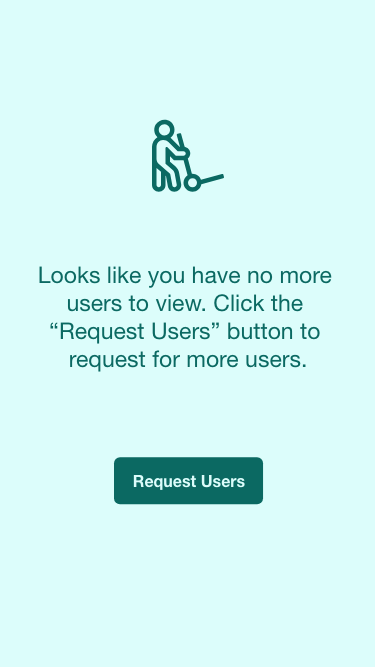

##💬 User Profile Viewer (Akkadu | Front End Engineer Challenge)

The goal of this challenge is to create a [Vue.js](https://vuejs.org) / [Nuxt.js](https://nuxtjs.org) users application that allows you to view users from the following API endpoint:

```bash
https://akkadu-careers.s3.cn-north-1.amazonaws.com.cn/challenges/fe/data/json/users.json
```

Make use of core Vue.js tools and packages (Vuex, Vue Router, etc.) to assist you with building the front end of the chat app. Feel free also to use a styling standard of your choice for you CSS.

It would be great if you could also come up with some UI designs and include them inside the [submission](../submission/) directory along with your challenge submission.

#### 💻 Desktop UI Designs
     

#### 💻 Mobile UI Designs
    

### 🐚 Challenge Conditions
- **Do not use any UI libraries if you can**. We'd like to know that you understand the concepts of building components that are reusable.
- All CSS should be written in SCSS.
- Make use of components in your user interfaces as much as possible.
- Your components should be tested.
- Make use of the color palette provided below:
```scss
:root {
  --color-100: #dcfdfb;
  --color-200: #b8f3ee;
  --color-300: #93e9e1;
  --color-400: #6aded5;
  --color-500: #43d5c9;
  --color-600: #2abcb0;
  --color-700: #1b9289;
  --color-800: #0b6962;
  --color-900: #00403c;
  --color-1000: #001816;
}
```

### ⚡️ Challenge Submission
Once you're satisfied with your submission, follow [these instructions](../README.md#open-a-pr) to create a pull request for your submission! Good luck!